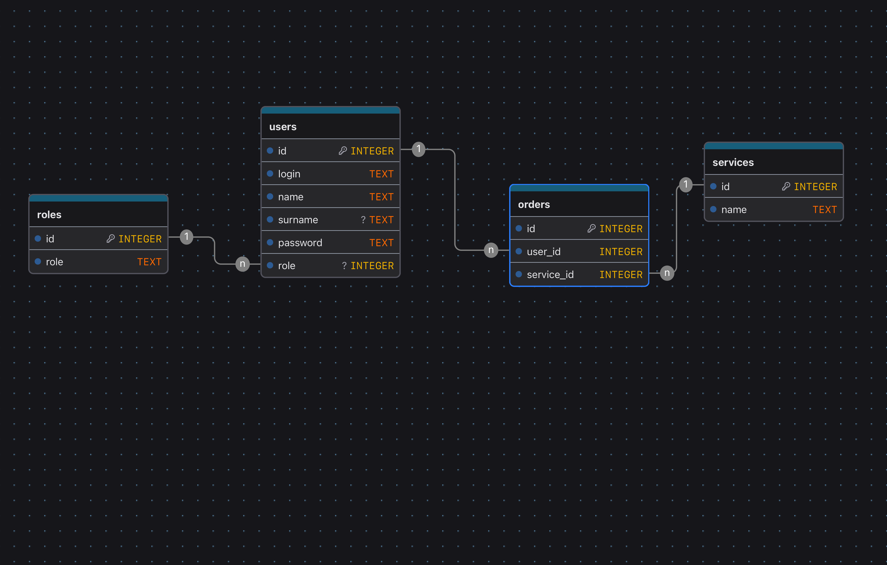

# Проект ЦОДД Смоленской области

Краткое описание архитектуры и решения для многостраничного адаптивного сайта и связанных сервисов ЦОДД Смоленской области.

## Задача, которую решаем
- Обеспечить гражданам удобный доступ к информации и онлайн‑услугам ЦОДД.
- Визуализировать данные (графики, карты, фото до/после) и показатели работы.
- Обеспечить масштабируемость и надежность за счет микросервисной архитектуры.

## Ключевая идея
- Разделение системы на независимые микросервисы: `frontend`, `backend`, `database`.
- Единый REST API для взаимодействия фронтенда и бекенда, автогенерация OpenAPI.
- Контейнеризация и изоляция сервисов для быстрого развертывания и масштабирования.

## Используемые технологии
- Frontend: React 19, Vite, Tailwind CSS v4, React Router.
- Backend: Python 3.13, FastAPI, SQLAlchemy, Uvicorn.
- Database: PostgreSQL (реляционная модель), связи users/roles/orders/services.
- Инфраструктура: Docker/Compose, Nginx (проксирование/HTTPS).

## Инновационные аспекты
- Адаптивный дизайн (mobile‑first), высокая производительность (Vite, оптимизация ассетов).
- Data‑driven дешборды и аналитика, в том числе импорт данных из XLSX и транзакций.
- Безопасность: аутентификация по JWT, разграничение доступа.
- Масштабирование по сервисам, готовность к CI/CD и кэшированию.

## Подробная документация
- [описание frontend микросервиса](frontend/README.md)
- [описание backend микросервиса](backend/README.md)
- [описание database микросервиса](database/README.md)

## Диаграммы архитектуры
- DFD / UML (Component, Deployment): файл `<Безымянный-2025-09-23-1316.excalidraw-2 (2).svg>` в корне репозитория. Отражает основные модули (`frontend`, `backend`, `database`, `nginx`) и способы коммуникации (REST API, проксирование через Nginx, доступ к БД).

.svg>)

Кратко: `frontend` обращается к `backend` по REST, `nginx` выполняет реверс‑прокси, `backend` работает с `PostgreSQL` через ORM, отдельные сервисы масштабируются независимо.

- ER-диаграмма БД: `database/database-2.png` — сущности `users`, `roles`, `services`, `orders` и их связи.

Кратко: пользователи связаны с ролями, заказы связывают пользователей и сервисы; ключевые поля индексированы, внешние ключи обеспечивают ссылочную целостность.

