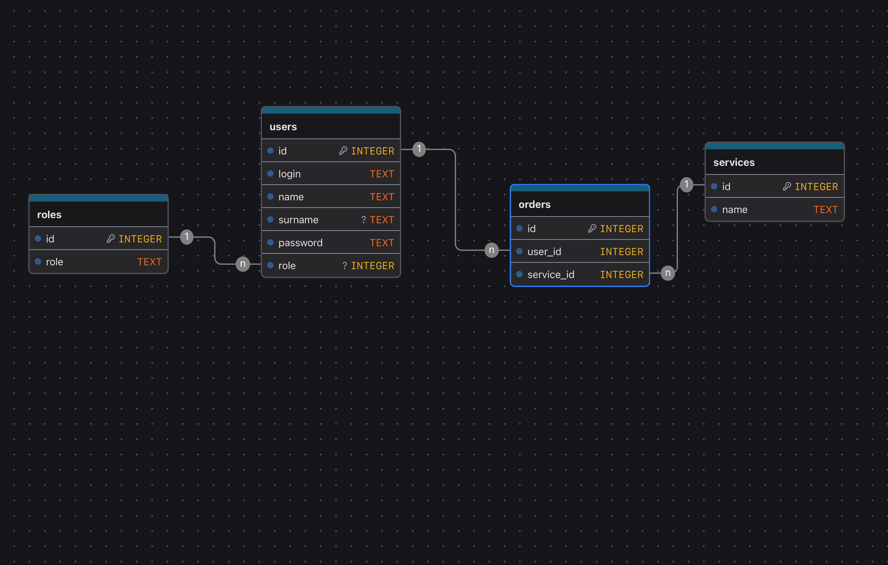

# Database Service (PostgreSQL)

Микросервис **Database** отвечает за хранение всех данных системы. Используется всеми backend-сервисами через ORM **SQLAlchemy**. Сервис основан на реляционной базе данных **PostgreSQL**.

## Основные таблицы

### 1. users
Хранит информацию о пользователях системы.

| Поле      | Тип      | Ограничения                         | Описание                        |
|-----------|---------|------------------------------------|--------------------------------|
| id        | integer | PK, auto increment, not null, unique | Уникальный идентификатор пользователя |
| login     | text    | not null, unique                    | Логин пользователя             |
| name      | text    | not null                            | Имя пользователя               |
| surname   | text    | nullable                             | Фамилия пользователя           |
| password  | text    | not null                            | Хэш пароля                      |
| role      | integer | FK -> roles.id                       | Роль пользователя              |

---

### 2. roles
Содержит возможные роли пользователей.

| Поле | Тип     | Ограничения              | Описание                  |
|------|---------|-------------------------|---------------------------|
| id   | integer | PK, auto increment, not null, unique | Уникальный идентификатор роли |
| role | text    | not null, unique        | Название роли             |

---

### 3. services
Содержит перечень доступных сервисов, которые могут быть заказаны пользователями.

| Поле | Тип     | Ограничения  | Описание               |
|------|---------|-------------|------------------------|
| id   | integer | PK, auto increment, not null, unique | Уникальный идентификатор сервиса |
| name | text    | not null    | Название сервиса       |

---

### 4. orders
Хранит информацию о заказах пользователей.

| Поле       | Тип     | Ограничения           | Описание                               |
|------------|---------|---------------------|---------------------------------------|
| id         | integer | PK, auto increment, not null, unique | Уникальный идентификатор заказа |
| user_id    | integer | not null, FK -> users.id | Пользователь, который создал заказ |
| service_id | integer | not null, FK -> services.id | Заказанный сервис                  |

---

## Связи между таблицами

- **users.role → roles.id**  
  Каждый пользователь имеет роль, которая хранится в таблице `roles`.  
  `delete: no action, update: no action` — удаление или изменение роли не затрагивает пользователей.

- **orders.user_id → users.id**  
  Каждая запись в `orders` связана с пользователем.  
  `delete: no action, update: no action` — удаление пользователя не приводит к каскадному удалению заказов.

- **orders.service_id → services.id**  
  Каждый заказ относится к одному сервису.  
  `delete: no action, update: no action` — удаление сервиса не каскадит заказы.

## ER-диаграмма

Изображение ER-диаграммы находится в репозитории: `database/database-2.png`.

## Индексы и ограничения

- `users.login`: UNIQUE индекс для обеспечения уникальности логинов и ускорения аутентификации.
- `users.role`: обычный индекс для быстрого выбора пользователей по роли.
- `roles.role`: UNIQUE индекс для уникальности названий ролей.
- `orders.user_id`, `orders.service_id`: индексы по внешним ключам для ускорения JOIN и выборок.

Ограничения целостности:
- NOT NULL на ключевых атрибутах (`users.login`, `users.password`, `orders.user_id`, `orders.service_id`).
- FOREIGN KEY ограничения между таблицами, описанные выше.

## Принципы хранения и обработки данных

- Хранение паролей только в виде криптографических хэшей (например, `bcrypt`/`argon2`).
- Нормализация: разнесение справочников (`roles`, `services`) и фактов (`orders`, `users`).
- Транзакционная целостность: операции создания заказов выполняются в одной транзакции.
- Аудит и трассировка: рекомендуются поля `created_at`, `updated_at` для всех таблиц.
- Резервное копирование: регулярные бэкапы БД, восстановление проверяется процедурно.